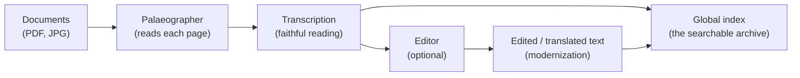

# pha for historians — a step-by-step guide

**pha** (Personal Historical Archive) keeps your manuscripts, old books and
maps in a local archive: you drop files into a folder, a vision model reads
each page, a text model can modernize or translate the transcriptions, and
everything becomes searchable by your AI assistant.

## What problem **pha** solves

### Ai needs context to be smart

To understand what **pha** does and why it is needed it helps to understand how AI deals with queries and the role of what is called "context". 

"Context" is the information that is provided to the LLM to facilitate answering your queries. The AI has no memory of your conversations nor any capacity to learn from its interactions with you. It knows what it learned during training before being released in the world. Everything that is relevant to answer your query and is not part of its initial training must be provided as context, including the record of your past interactions. 

You can attach a document to a query and ask the LLM to answer a query about it. The information you provide, plus the record of past interactions, plus some generic instructions about how to answer, together, make the so called "context" of the query. 

Moreover, in order to be able to answer queries with updated information, most AI interfaces first search the internet for the topics of the question, collect relevant information, put it in the context along with the record of previous converstations and append your question. The question might have 10 words but the LLM will receive substatially longer text in which to base its answer.

### Context is limited

But here is the catch: the amount of information that is possible to put into the context is limited. You cannot attach the 12 voluments of Documenta Indica and ask a question about its contents. Also, as time goes by, the record of your conversations might not fit in the context.  Processing long context is computationaly expensive, so AI providers need to limit its length, while trying to find new methods to deal with it efficiently. AI forgets things that it remembered before. The size of files you can attach to a query is also strictly limited.


### Puting your documents in the context

But what if your relevant information is stored in dozens documents in your computer, such as PDFs and digital images downloaded from digital libraries and archives or scanned by yourself? In that case, it is your local files and not the internet that needs to be searched to create the context that enables the LLM to answer your questions.

This is a common scenario in many organizations and tools exist that search PDFs, word processor documents, spreadsheets and  databases to extract information to compose the context sent with queries to LLMs. The process is kown as "RAG" (Retrieval Augmented Generation) and RAG tools maintain and search repositories of documentsm allowing AI agents to extract meaninfull information for the context of queries.

RAG creates indexes by processing chunks of text into matematical representations similar to those used internally by LLMs, in a process known as "embedding". This allows the tools to gather results that are semantically related to the question posed and not just those that contain the exact words

### Why is historical information special?

Historical documents in computers are special because they consist mainly of images of old books or manuscript documents which cannot be easily searched to extract relevant context. 

Unlike modern PDFs, which are generated from texts produced orignally in computers, historical documents in PDF form are made by scanning or photographing texts. They may contain a layer of text produced by OCR (Optical Character Recognition).  OCR attempts to reconstruct the text from images by identfying the form of characters and embeds the result into the PDF so it can be searched and copied. 

The quality of OCR text varies with the clarity of the original printed text, the quality of the scan and the effiency of the OCR software. Mmany of the digital copies of historical sources available in digital libraries and archives have poor quality embeded text. Manuscripts and many books don't have any text layer at all. 

Moreover, in historical contexts, spelling varies greatly and abreviations are intensively used in writing. Even if good OCR is possible, the result is not ideal for RAG.

### The solution: read the sources, edit the result, store in a semantic index

The solution is to read the documents and the manuscripts using today's technology. OCR software has evolved and may produce more accurate readings that the one included in the documents. But the most relevant breakthrough brough by AI is that some modern LLMs have "vision" capabilities: they are able to generate text from images and can be asked to read old prints and manuscripts provided as context.

LLMs read by reasoning over the image. If adequately instructed they can use background information of what they are reading to clarify dubious content. They operate more like an human reader than the pattern matching OCR softare.

Also LLMs are able to analyse the result of the reading and perform operations like modernization of language, expansion of abrivations, extraction of personal and geographic names, or other named entities and translation from language in which the reader is unfamiliar.

This implies a specific pipeline to create repositories of historical documents that play well with context generation for LLM inference. 

The pipeline consists of:
1. Identify the best approach to generate text from the document. Options are: use the embeded OCR if adequate; redo the OCR with recent software; use vision enabled models with specific reading prompts; 
2. Edit the resulting text: modernizing ortography,  extracting named entities (people, places, institutions), translating if relevant. This step may be skipped if text is usable in the original embeded form.
3. Store the result in a semantic index, searchable by  AI agents for the purpose of providing context of queries to LLMs.

The workflow, left to right:



*pha* is a tool that makes it simple for AI agents to manage this workflow.

You do not need to touch the command line yourself, and you never need to
learn a command — you work through **your favourite AI agent**, for example
Claude, ChatGPT, DeepSeek (including DeepSeek Harness), Kimi, Cursor, Gemini
or Copilot. The steps below tell you what to ask, in ordinary language.
Wherever a technical step is needed there is a block like this one

```
… a message you copy into the chat …
```

and your agent does the rest. Everything in a block is for the agent, not
for you.

---

## Before you start

You need:

- A computer with **macOS or Windows**
- An AI assistant you trust with file operations. If you have not used an AI assistant before, or are unsure about it, check our suggestion [Setting up an AI harness in your machine](HARNESS_INTRODUCTION.md).
- **The AI models pha uses** — the models that read and transform your pages.
  There are two ways to get them, and you can use both side by side:
  - **Local models**, run on your own machine by **LM Studio** (free, from
    lmstudio.ai). Nothing ever leaves your computer, but your hardware limits
    which models can run and the speed at which they work.
  - **Remote models**, hosted by a provider (DeepSeek, MiniMax, OpenAI, Anthropic, OpenRouter,…)
    and reached over the internet. They are far more powerful, but you need an
    **API key** from the provider and the page images are sent there. See
    step 1c.

The archive itself always lives on **your** computer. Only the pages you
choose to process with a remote model leave it; local processing stays
entirely on your machine.

### Create the workspace folder first: it becomes your archive

Your archive lives in **one folder on your computer**, and that same folder
is the dedicated **project / workspace** you work in with your agent (a
project folder in Cursor or Claude Code; in Claude or ChatGPT, the folder a
"project" can give access to). Everything pha keeps — your documents
(`dropbox/`), the transcriptions (`library/`) and the configuration — lives
inside that one folder, so you grant your agent file access **once**, and
every prompt of this guide stays grouped in the same workspace for every
session.

Create the folder now, **empty**: in step 1b pha turns it into the archive,
and pha refuses to create an archive in a folder that already has files in
it. Your own prompts are added *after* that (see the end of this section).

```
Create a dedicated workspace folder for my personal historical archive,
for example "~/My historical archive":
1. Create the folder and open it as the project/workspace I work with you
   in. Leave it EMPTY for now — in the next step you will create my pha
   archive inside it (documents, transcriptions and configuration).
2. Give this workspace permission to access this folder and to run pha on
   this computer — and nothing else.
```

Work with your agent in that folder from now on. It is the one folder your
archive lives in, so the agent will already know where the archive is and
have the file access it needs. Once the archive exists (after step 1b), you
can also keep your own prompts inside it, grouped in one place (e.g. a
`prompts/` subfolder): the prompts of this guide you want to reuse, the
Model Helper and Encoder Helper prompts (the files
`prompts/model-helper.md` and `prompts/encoder-helper.md` in the pha
installation), and any prompts you write later for your own collections.

---

## How your pages can be read: the ladder

There are **four ways** to turn a page into text. Think of them as a ladder:
the simplest and cheapest rung at the bottom, the most capable — and most
expensive — at the top.

| Rung | Method | What it is | What it costs |
|------|--------|------------|---------------|
| 1 | **Builtin text** | The text already stored inside the PDF, reused as it is. | Free and instant; only when the file already has good text |
| 2 | **OCR text** | An OCR program recognises the shapes of printed letters. No AI model at all. | Free and instant; printed text only, no notes |
| 3 | **Local vision model** | An AI model on your own computer reads the page, with context and brief reading notes. | Free; needs a capable computer; nothing leaves it |
| 4 | **Remote vision model** | A very large AI model, reached over the internet, reads the page like a scholar. | Page images are sent to a provider; paid per page |

Start at the **lowest rung that does the job** for a given collection, and
climb only as far as you must:

1. **Builtin text — check this first.** Many PDFs already carry their own text
   (files created digitally, and scans a library has already processed). When
   that text is good there is nothing to compute. When it is the leftovers of
   an old, poor OCR pass it is worse than useless — so pha tests its quality
   page by page and quietly falls back to OCR when it fails.
   *Best for:* digital-born PDFs and well-made library scans of printed text.
2. **OCR text** — an OCR engine (Tesseract, or LiteParse which bundles it)
   looks at the shapes of the letters and types them out. It runs entirely on
   your computer, with no AI model. Fast and dependable on clean **printed or
   typeset** pages. It cannot read handwriting, and it gives no reading notes.
   *Best for:* printed books, typewritten letters, printed tables.
3. **Local vision model** — an AI model on your own computer reads the page as
   a scholar does: it follows the layout, resolves a damaged or difficult word
   **from context**, and can add brief reading notes (language, script,
   difficult words). Nothing leaves your computer.
   *Best for:* old printed text and the easier hands — use it whenever it is
   good enough.
4. **Remote vision model** — a much larger AI model, over the internet. This
   is the strongest reading available and today the only rung that reliably
   handles **difficult handwriting**, but the page images are sent to the
   provider and it **costs money per page**.
   *Best for:* handwritten manuscripts, secretary hands, damaged or heavily
   annotated pages.

Your choice is made **collection by collection**, so a printed book and a
folder of letters can be read differently, and nothing is permanent — you can
change a collection's method and read it again at any time.

---

## 1. Set up the models and install pha

You can ask your agent to do all of it. Three short steps, in order (step 1a —
installing LM Studio — is only needed if you will run models locally; for
remote models you can skip it and go straight to step 1b):

### 1a. Install LM Studio (if you don't have it)

```
Please install LM Studio on my computer: download it from lmstudio.ai,
install it, and open it so its local server can run. Tell me when it is ready.
```

### 1b. Install pha (from GitHub)

Copy this into your agent's chat and let it do the work:

```
Please install the "personal-historical-archive" (pha) program from
https://github.com/joaquimrcarvalho/personal-historical-archive

Steps:
1. Clone the repository to a folder of your choice, e.g. ~/develop/personal-historical-archive
   (the code stays there — it is NOT my archive)
2. Install `uv` if it is not present, create a Python virtual environment
   in the project and install the package (uv pip install -e .)
3. Check that LM Studio is running with its local server on port 1234.
4. Set up my archive in the empty workspace folder I created at the
   beginning, "~/My historical archive":
       pha init-archive "~/My historical archive"
       pha set archive-dir "~/My historical archive"
5. Verify the installation and tell me the result of `pha status`.
```

**Your agent will ask where your archive is — expect it.** A freshly
installed pha does not know any archive yet, so on its first real action it
stops and asks you for the archive's location. The answer is the **workspace
folder you created in the previous step**; your agent will normally suggest
it, because that is the folder you designated as the archive's home. Confirm
it, and the agent creates the archive inside that folder and remembers the
location for every future session. If that folder already has files in it,
tell the agent to create the archive in an empty subfolder inside it instead.

What you should see afterwards: a short report that the archive is ready and
which reading and editing helpers are configured. Installing pha before
choosing the models lets your agent check your actual setup when it makes the
recommendations below.

**Windows note:** everything works on Windows too; only some folder names
inside the computer differ. Your agent will handle this.

### 1c. Choose the best models for your documents

pha is now installed, so your agent can first look at your actual setup and
then research with that in hand.

Different vision and text models are better for different material, and you are
not limited to what runs on your own computer: pha can use **models hosted
remotely** as well as local ones. That matters more than you might expect.

Two important facts in September 2026:

- **Reading handwritten manuscripts well needs a powerful vision model.** The
  best current vision models (large multi-modal models) are far too big to run
  on a normal laptop or desktop, so **today manuscript reading almost always
  uses a remote model**. This will tend to change in the future as stronger
  models run locally — but don't be surprised that the manuscript-reading model
  is not on your machine yet. For **old printed / typeset text**, by contrast,
  a local vision model (or OCR — see below) is normally fine; printed letters
  and shapes don't need that much judgement.
- **Editing/translating text is lighter than reading a page** — no images are
  involved, so a local text model is often enough (it can also be remote if you
  prefer). It is a **separate choice** from the reader: if you need a
  translation out of a language you do not read (Latin, classical Greek, …),
  that calls for a model with strong ability in that language.
- **Remote image processing costs money.** A page image is a lot of tokens, so
  a remote vision model bills more per page than a local one (this is a
  current limitation of how vision models are priced). It is usually worth it
  for handwritten manuscripts; for clean printed text a local model or OCR is
  much cheaper.

So the practical setup for most historians right now is: a **remote vision
model** for handwritten **manuscripts**, a **local vision model (or OCR)** for
old **printed / typeset text**, and a **local text model** to edit everything
(remote if you prefer). Use whichever fits each collection — you are not locked
into one model for the whole archive. Below are prompts for both local and
remote cases.

#### Local models (everything on your machine)

Ask your agent to research and recommend:

```
Research and recommend the best LOCAL models for my archive, considering my
computer specs (e.g. MacBook Air M2, 24 GB RAM):

1. a VISION model for reading pages of [describe your documents, e.g. printed
   19th-century Portuguese books and 17th-century manuscript letters] —
   give me 2-3 options with a clear recommendation
2. a TEXT model for editing transcriptions (modernizing old Portuguese,
   translating to English) — 2-3 options with a recommendation
3. an EMBEDDING model for search (a small one is fine)

Then tell me exactly which models to download in LM Studio and their names
in the LM Studio catalog.
```

A good starting point, already configured in pha by default: the vision model
`qwen/qwen3-vl-8b` (excellent at reading historical text), the embedding model
`text-embedding-nomic-embed-text-v1.5`, and the text/editing model
`amalia-9b-0626-dpo` (or `google/gemma-4-e4b`). Keep these if the research
agrees, or switch per the recommendation.

#### Remote models (hosted by a provider)

For the reading model in particular, this is the route most historians will
take today. To use a remote model you need an **API key** from its provider
(an account with MiniMax, OpenRouter, OpenAI, … gives you one; some are paid).
Give your agent a prompt like this:

```
Set me up to use a REMOTE vision model to read my manuscripts. Please:

1. Research and recommend 2-3 strong REMOTE vision models for reading
   [describe your documents, e.g. 17th-century manuscript letters] and pick one.
2. Tell me which provider hosts it and exactly how to get an API key
   (create an account / buy credits / copy the key from the provider's
   dashboard). Do not invent a key — tell me what to do.
3. Once I give you the key, store it safely (run: pha key --set VARNAME,
   where VARNAME is a name pha recognizes, e.g. MINIMAX_API_KEY or
   OPENROUTER_API_KEY). Keep the key secret — do not paste it into documents.
4. Create the model file (models/<id>.md) with the provider's base_url, the
   server-side model name, api_key: "${VARNAME}", and api_style (openai by
   default; anthropic for MiniMax). Set the vision limits (max_vision_px,
   vision_jpeg_quality, context_tokens) to suit the model.
5. Point my palaeographer/editor rules at it in pha.yaml, then verify with
   `pha test` on a couple of pages. Tell me the result.
```

If you would rather not write all that, ask your agent to run the
**Model Helper** prompt (see the note below) — it asks you a few plain-language
questions and produces the model + rules files for you, local or remote, and
safely stores the API key.

> [!TIP]
> **Model Helper prompt for your agent.** A ready-to-use interview prompt that
> guides an agent through configuring any pha model — local (LM Studio /
> Ollama) or remote (MiniMax, OpenRouter, OpenAI, …) — is in
> `prompts/model-helper.md`. Have the agent read that file and follow it: it
> asks you for the provider, the endpoint and the model name, whether the model
> needs to see images, and (for a remote model) stores your API key safely and
> writes the configuration files for you.

---

## 2. Put your documents in the archive

Your archive's "dropbox" folder is already set up with the layout pha
expects — you only add content to it. Tell your agent:

```
Copy my files into the archive's "dropbox" folder, following these rules:
- a PDF or an image file = one document → goes into dropbox/documents/
- a FOLDER containing only images = one document whose pages are those images
  (put it inside documents/ or inside a collection)
- anything that belongs together historically (e.g. all letters of one
  correspondence) goes into its own collection folder under
  dropbox/collections/ — create the collection folder if it does not exist yet
- tell me where each file ended up
```

Rules of thumb for your own use:

- **One document** = a PDF (many pages) **or** an image (one page) **or** a
  folder of page-scan images (each image becomes a page).
- **A collection** = a folder that groups related documents, e.g.
  `collections/missons-do-oriente/`. The folder name becomes a way to filter
  searches.
- Keep the originals somewhere safe; pha reads a copy you place in the
  dropbox and never modifies your source files.

---

## 3. Set up palaeographers and editors

Two kinds of "helpers" read and improve your documents:

- **Palaeographer** — a vision model that *reads* a page image and transcribes
  it. Different palaeographers can be specialised for different hands or
  languages (e.g. 17th-century Portuguese secretary hand). A palaeographer
  **only transcribes faithfully** — it does not expand abbreviations,
  modernize or translate; and its notes are brief reading notes (language,
  script, difficult words), not entity lists or summaries. Entity lists,
  summaries and structured records come from the editor and encoder.
- **Editor** — a text model that *transforms* the transcription: expand
  abbreviations, convert to modern Portuguese, translate to English,
  normalize names, …

Each is a small instruction file kept in your archive — one describing how to
**read** a page, one describing how to **edit** the reading. You never have to
write them yourself: describe in plain language what you need, and your agent
writes the file and tells pha to use it.

Tell your agent:

```
Show me the current palaeographers and editors (run: pha palaeographer
and pha editor). Then, for my documents, I want:

[describe what you need, for example:]
- a palaeographer specialised in 17th-century Portuguese secretary hand,
  transcribing faithfully in the original language
- an editor that converts the transcriptions to modern Portuguese

Create the corresponding files by copying palaeographers/_sample.md and
editors/_sample.md, giving them good names, setting `model:` (the model we
chose in step 1c) and temperature, and writing the instructions in the body.
Then SELECT them for my collections: write a pha.yaml sidecar in each
collection folder, e.g.
  palaeographer:
    rules: portuguese-secretary
  editor:
    rules: modern-portuguese
Show me the result of:
  pha palaeographer
  pha editor
```

Notes:

- These choices are made **collection by collection**, so one collection can
  be read by one specialist and another by a different one. That is how your
  editorial choice is recorded.
- You can change any of it later just by describing what you want; your agent
  updates the archive for you.

### Choosing the rung: let your agent test it

You do not have to guess. If the agent you are working with **can see images
itself** — a local agent with vision, such as DeepSeek or Kimi running with a
vision model — it can look at a few pages and settle the question for you:

```
Use your vision to read a few reference pages and test what is the best
method for reading the document:
1. Pick a few representative pages of the document (one easy, one hard).
2. Read those pages yourself first, so you know what they really say.
3. Use `pha test` on those same pages to try each reading method in the
   ladder order — the file's builtin text, OCR, a local vision model, and a
   remote vision model — overriding the palaeographer and model for each run
   (e.g. pha test <document> --pages 3 --palaeographer <rules> --model <id>).
   `pha test` works on a sample and changes nothing in my archive, so it is
   safe to repeat; it prints a report, and `pha test --show` re-prints the
   last one.
4. Compare each result with your own reading, and tell me in plain language
   which method is best for the result, the time and the money.
5. Set the collection up to use the method you recommend, and show me the
   comparison.
```

If your agent cannot see images, it can still make the same test through pha
and report the results — just ask it to *"test the reading methods on a few
pages of this document and recommend the best one"*.

The reading method is chosen per collection. The **editing** that follows is a
completely separate choice: the editor only ever works on the text, so it does
not need to see images, and it can be a different model altogether. Choose it
for what *editing* demands, not for how the page was read — and above all, if
you want a translation out of a language you do not read (Latin, classical
Greek, …), choose a model with strong ability in that language.

---

## 4. Process the documents and query the archive

### First run (processing)

Tell your agent:

```
Run the extraction:  pha scan
Then, when it finishes:  pha edit
Then show me:  pha status
```

- The first pass reads every page with the reading method you chose.
- The second pass edits the readings (modernise / translate).
- Large books take time; the work can be resumed — if the computer sleeps or is
  restarted, ask your agent to carry on and it continues where it stopped.

### Searching

Ask in plain language, for example:

- *"Search the archive for mentions of Malacca."*
- *"In the collection missons-do-oriente, find the pages about Francis Xavier."*
- *"Show me the full transcription of that page."*

Your agent answers these directly when it is connected to the archive (below).

### Letting your agent query directly (MCP)

For agents that support MCP (Claude Desktop, Cursor, DeepSeek, Kimi, …), the
archive exposes its search as tools. Ask your agent:

```
Connect to the local MCP server "personal-historical-archive" using:
  <path-to-project>/.venv/bin/python -m personal_historical_archive mcp
(with the environment variable PHA_HOME set to the project folder)
Then use its tools: pha_search, pha_get_document, pha_list_documents,
pha_scan_now, pha_extraction_status.
```

After that you can simply ask questions and the agent will query the archive
itself.

---

### Using the archive from another machine (remote)

You can also work with the archive **from a different computer** — add
documents, or let an agent there search what is already transcribed — while
the archive and models stay on this machine. You do this by making the
archive available over the network (an "MCP server"). Ask your agent:

```
Make the archive available to another machine:
  pha mcp --transport sse --host 0.0.0.0 --port 8000
and tell me the address this computer's network uses (e.g. 192.168.1.20).
(Optional: first run  pha set dropbox <folders>  if you want to move the
documents folder.)
```

From the other machine, an agent can then connect and, among other things,
add a document to the archive, ask how a collection is being processed, and
search what is already transcribed.

Keep the network address internal (home/office network or a VPN). The archive
is designed so the heavy AI models only ever run on **your** machine. The file
`MCP_CLIENTS.md` has the detailed setup for a technical helper.

---

## Where the results are

For each document, in the `library/` folder, mirroring the dropbox layout.
Each document version has a readable folder named after it and its date
(e.g. `1567-Coimbra_2026-08-22`); pages are named after their source scan
(for a folder of images) or `page-NNN` (for a PDF):

```
library/<collection>/<document>_<date>/transcription-<palaeographer>/502V.md   ← faithful transcription
library/<collection>/<document>_<date>/edited-<editor>/502V.md                 ← modernized / edited
```

Each page file starts with a small header (source file, page number,
palaeographer, editor, status) followed by the text.

---

## Giving a document its full bibliographic reference

By default a citation says only which file and page it came from:

```
DocHistMissPadPortOriente_vol04_1548-1550.pdf — doc 22, p. 437
```

That identifies the scan, not the *work*. To make citations citable in a
footnote, put a **reference file next to the document**, named after it:

```
dropbox/collections/DocHistMissPadPortOriente/
    DocHistMissPadPortOriente_vol04_1548-1550.pdf
    DocHistMissPadPortOriente_vol04_1548-1550.dc.json   ← the reference
```

(For a document that is a *folder* of images, the file goes inside the folder
and is named after the folder: `vol04/vol04.dc.json`.)

The format is **plain JSON** — write the fields you know and leave out the rest:

```json
{
  "title": "Documentação para a história das missões do padroado português do Oriente",
  "part_number": "IV",
  "creators": [{ "name": "Rego, António da Silva", "role": "editor" }],
  "place_of_publication": "Lisboa",
  "publisher": "Agência Geral das Colónias",
  "date_issued": "1950",
  "shelfmark": "BNP RES. 1234 V.",
  "repository": "Biblioteca Nacional de Portugal",
  "record_origin": "human-supplied"
}
```

Field names are forgiving: `part_number`, `partNumber` and
`dcterms:partNumber` all mean the same thing, so you can paste a record from
another tool unchanged. All the fields:

| field | meaning |
| --- | --- |
| `title`, `sub_title` | the work's title |
| `part_number`, `part_name` | the volume / part of a set |
| `creators` | list of `{"name": ..., "role": ...}` — role is optional |
| `place_of_publication`, `publisher`, `date_issued`, `edition` | the imprint |
| `repository`, `shelfmark` | where the copy is, and its shelf mark |
| `identifiers` | list of `{"value": ..., "type": ...}`, e.g. an ISBN |
| `language`, `type`, `genre`, `format`, `extent`, `rights`, `classification`, `subject` | further description |
| `is_part_of` | the containing work: `{"title": ..., "volume_number": ...}` |
| `citation` | an exact citation string to use verbatim, instead of the assembled one |
| `record_origin` | where the reference came from (see below) |

Then ask your agent to check the file and show you a citation:

```
Check the reference file beside "<document>" and tell me what pha understood
from it. Then show me how a citation of one of its pages reads now, and fix
anything I wrote wrongly.
```

**If your reference came from Zotero** (which exports an XML format meant for
machines, not people), you do not have to edit XML. Ask your agent to convert it
once, and edit the readable file from then on:

```
The reference beside "<document>" is a Zotero export in XML. Convert it to the
readable JSON form and save it beside the document, then show me the result.
Do the same for every other document that has an XML reference.
```

### BibTeX, if you prefer it

A `.bib` file works exactly the same way — put `<document>.bib` beside the
document instead. This is also the format to use when **an assistant drafted the
reference for you from the scan itself** (reading the title page), with no
Zotero involved:

```bibtex
@book{rego1950,
  title     = {Documentação para a história das missões do padroado português do Oriente},
  editor    = {Rego, António da Silva},
  volume    = {4},
  address   = {Lisboa},
  publisher = {Agência Geral das Colónias},
  year      = {1950},
  shelfmark = {BNP RES. 1234 V.},
  record_origin = {human-supplied}
}
```

`title`, `author`/`editor`/`translator`, `volume`, `address`, `publisher`,
`year`, `edition`, `language`, `pages`, `isbn`, `url`, `series`+`number` and
`keywords` are all understood; `shelfmark`, `repository`, `record_id` and
`record_origin` are additions of ours. LaTeX accents (`{\'o}`, `\c{c}`) and
UTF-8 both work, so a record pasted from anywhere reads correctly. To turn an
existing reference into BibTeX, just ask your agent to convert it.

**If an assistant drafted the reference, it must say so.** Drafting a reference
from the scan itself (reading the title page) is allowed and useful, but it must
be marked as drafted and unverified:

```
Draft a bibliographic reference for "<document>" from its title page, save it
as a BibTeX file beside the document, and mark it as drafted and unverified
(pha bib <doc> --to-bibtex --origin agent-drafted-unverified --write) so that
every citation of it carries an "unverified reference" warning until I check it.
```

That warning stays on every citation until a person checks the reference against
the book. Never remove it without checking — an invented publisher, volume or
shelf mark looks exactly like a right one. Once you have checked it, ask your
agent to mark it as confirmed by you.

**Nothing is inherited.** A document with no reference file simply keeps the
old filename citation — pha never borrows a neighbouring document's reference,
because a wrong citation is worse than a plain one. Your agent can list which
documents still have no reference.

`record_origin` says where the reference came from. A reference marked
`agent-drafted-unverified` is shown with a `[unverified reference]` warning in
every citation until a human confirms it. A reference merely *imported*
(`fetched-from-zotero-unverified`, or a `.bib` with no `record_origin` at all)
is **not** warned about in citations, because it is library data rather than a
model's guess; your agent can report which references are not yet reviewed, and
you can mark them confirmed as you check them.

---

## Reviewing and correcting the transcriptions

You can read the library files and correct them. Each page is stored twice,
and **which one you correct changes what happens next**:

- the **transcription** — the reading taken from the page image. Correcting it
  fixes a misreading at the source; the editor must then run again to use your
  corrected text.
- the **edited text** — the modernised or translated version. Correcting it
  fixes the final output, and pha then leaves it exactly as you wrote it.

**If you corrected the TRANSCRIPTION** (for example you spotted a reading
error):

1. Open the transcription page file and correct the text under the header
   (leave the header itself as it is).
2. Ask your agent:

```
I corrected the transcription of page <N> in "<document>". Import my
correction, re-run the editor for that one page so it uses my text, and update
the search index. Tell me how many pages you imported, and the result.
```

Your corrected text becomes the page's reading, and pha will never read that
page from the image again.

**If you corrected the EDITED text** (the editor's final output):

1. Open the edited page file and correct the text under the header.
2. Ask your agent:

```
I corrected the edited text of page <N> in "<document>". Import my correction
and update the search index. Tell me the result.
```

That page is then protected: neither a new reading pass nor a new editing pass
will overwrite your wording. Corrected pages are marked as *reviewed* in their
file.

Your agent imports **only the pages you actually changed**, and leaves every
other page alone. If you ever need to hand a page back to the machine — for
example before reading it again with a new method — ask the archive operator to
release it. Your text stays exactly as you wrote it; only the protection is
removed.

---

## Troubleshooting (quick)

- **Nothing happens, or an error mentions a model** → for a **local** model,
  ask your agent to check that LM Studio is open and running. For a **remote**
  model, ask it to check that your API key was stored and is being used. Then
  ask it to test the model on a page and tell you the result.
- **"No pha archive is configured or found"** → the archive was never set up,
  or its location has been forgotten. Point your agent at the workspace folder
  you created at the beginning; it will create or reconnect the archive and
  report back.
- **The reading seems stuck** → it is probably waiting because the computer
  slept. Ask your agent to continue; the work resumes where it stopped.
- **Search returns nothing** → the reading may not be finished yet. Ask your
  agent how far it has got.
- **Windows** → everything works; only some internal paths differ, which your
  agent handles.

---

*pha is designed so that historians control the editorial choices — which
palaeographer reads, which editor transforms — while the technical work stays
in the hands of your AI assistant.*
