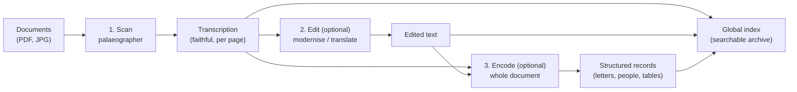

# How the pha pipeline works

A plain-language guide to what pha does with your documents, and to the files
that decide **how** it does it. The first part explains the machine; the file
table at the end is for when you want to look at something yourself.



---

## The phases: scan → edit → encode

pha works in three phases. **Scan always runs. Edit and encode are optional**
— you can add them later, change them, or do without them.

### 1. Scan — read the pages

Your documents are copied into the archive, each page is turned into an image,
and the **palaeographer** reads each image and writes a faithful transcription:
the original spelling, `[illegible]` or `[?]` for what cannot be read, plus a
few short reading notes (language, script, difficult words).

The palaeographer **must not** modernise, translate or expand abbreviations —
that is the editor's job, and keeping the two apart means the transcription
stays a true record of the page.

A palaeographer can be an AI vision model (on your computer, or a remote one)
or, for clean printed text, a local **OCR engine** (Tesseract, LiteParse) that
uses no AI model at all.

*Result:* one text file per page, and the same text in the searchable index.

### 2. Edit — modernise or translate *(optional)*

The **editor** is a text model that transforms the transcription: expand
abbreviations, modernise spelling, translate (for example Latin into English),
normalise names.

The transcription is never overwritten — the edited text sits beside it, and
**both versions are searchable**. If no editor is configured, pha simply copies
the transcription through, so the archive still works.

### 3. Encode — turn the text into structured records *(optional)*

The **encoder** is a text model that reads the document as **one whole text**
(the pages joined together) and returns structured records: one per letter, per
person, per entry — each carrying the page it starts on. That is what makes a
list of letters, a persons index or a table of entries out of prose.

The instructions live beside the documents, one file per kind of structure, and
an encoder can be limited to a page range — useful when one volume contains a
chronological table *and* a run of notices.

*Result:* a records file (`records-<encoder>.json`), the exact text the model
was given (`concatenated-<encoder>.md`), and the records in the index.

### What the records let you ask

Once a document has been through the encoder, you can ask about the **things in
it** rather than about the wording of the pages — which is usually what a
research question looks like:

- the letters, the people, the entries — one kind of record at a time;
- **an exact detail**: every record whose place is Malaca, whose sender is
  Xavier, whose date is 1553;
- or the records by meaning, the way you search the page text.

This is how *"find every letter sent by Xavier"* returns a list of records — each
pointing at the page it came from — instead of hoping the right words appear in
the transcription. Ask for it in those words and your agent will do the rest;
the same search can also look at pages and records together.

### Running the phases in practice

- They are separate commands, run in order: scan, then edit, then encode. The
  search index is kept up to date as they run; `pha reindex` rebuilds it when
  you have corrected text by hand.
- **Work already done is skipped.** If you change an instruction — a
  palaeographer, an editor, an encoder, or a filter — pha redoes just the
  affected part of the next run, without being asked.
- `pha test <document> --pages 3` runs the whole pipeline on a few sample pages
  in a scratch folder **without changing the archive** — the safe way to try
  something out with your agent.
- Only one model-heavy job runs at a time, because your computer holds one local
  model in memory.
- You can correct pha's text yourself in the `library/` folder and ask your
  agent to import your corrections.

### You never have to type commands

Everything above names commands such as `pha scan` and `pha edit`. Those are
what your **AI agent** runs on your behalf — you do not open a terminal,
install anything by hand, or remember any of them. You simply say what you
want, in ordinary words, and let the agent do the technical work.

For example:

- *"Give me the status of the archive."*
- *"How many pages are waiting for my review?"*
- *"Create a palaeographer for document X — it is a 17th-century Portuguese
  secretary hand, and I want it transcribed faithfully."*
- *"Create an editor that translates Latin into English and modernises the
  modern languages."*
- *"Search the archive for Malacca, then show me the full pages, not just the
  snippets."*
- *"Which model reads this collection? Show me the two files that decide it."*
- *"Write a note that summarises everything the archive has about the Jesuit
  missions in China, with the pages it comes from."*
- *"Page 12 is misread here — the correct reading is …; import my correction
  and update the search index."*
- *"That page came out badly. Re-read page 5 with a stronger model and show me
  the difference."*

A few habits make this go well:

- **Keep to the same agent** for your archive when you can. The archive carries
  its own instructions for agents (`AGENTS.md`) and its own task skills, so a
  new session can pick them up — but a familiar one already knows your
  collections, your models and the decisions you have made.
- **Ask it to say what it is about to do**, in plain language, before it does
  it, and to tell you what changed afterwards. You should never have to read a
  log or an error trace to find out what happened.
- **Anything expensive or hard to undo deserves a question first** — a long run
  on a remote model, deleting or moving a document. *"What will this change,
  and roughly what will it cost?"*
- **Ask where things live** whenever you are curious: *"show me the
  palaeographer file this collection uses"*, *"which filters run here?"* The
  table at the end of this document is written for exactly that.
- The commands in this document are for your agent (or for a technical helper
  you trust). You can paste one into the chat as a request, or describe what
  you want and let the agent choose the command.

For the step-by-step version — setting up, putting documents in, correcting
pages — see the historian guide `HISTORIANS_README.md` in the pha project, or
ask your agent to run `pha help historians`.

---

## How the process is configured

Three separate layers. Keeping them apart is what lets you change one thing
without disturbing the others.

| Layer | What it says | Where it lives |
|---|---|---|
| **Model** | *How to reach an engine* — its address, key, real name, limits | `<archive>/models/<id>.md` |
| **Rules / prompt** | *What to ask it to do* — the instructions and a few settings | `<archive>/palaeographers/`, `editors/`, `encoders/<id>.md` |
| **Selection** | *Which rules go with which model*, per collection, plus filters | `pha.yaml` beside the documents |

A collection's `pha.yaml` is short and readable — it names a rules file and a
model for each stage, and lists any filters:

```yaml
palaeographer:
  rules: portuguese-secretary      # palaeographers/portuguese-secretary.md
  model: deepseek-v4-flash         # models/deepseek-v4-flash.md
editor:
  rules: modern-portuguese         # editors/modern-portuguese.md
  model: mini-local                # models/mini-local.md  (a small text model)
encoders:
  - rules: letters                 # collections/COLX/encoders/letters.md
    model: mini-local
render: {max_image_px: 3000, jpeg_quality: 88}
```

The nearest `pha.yaml` as you go up from a document wins, so one collection can
be read differently from another.

### Palaeographers

One file per way of reading: "17th-century Portuguese secretary hand",
"printed books, 19th–20th century", "clean printed text by OCR". The file name
is the name you select; the body is the reading instructions.

### Editors

One file per transformation: "modernise old Portuguese", "Latin to English".
An editor is a text-only job, so it needs no vision and is often a smaller,
cheaper model than the reader.

### Encoders (the record-making instructions and scripts)

Encoder files live **beside the documents they describe**, in the collection's
own `encoders/` folder, one per structure type. Each encoder may be
accompanied by two optional companion files:

| File | Role |
|---|---|
| `letters.md` | the base rules — what a record of this kind is |
| `letters.prompt.md` | how to *find* them in the text (detection rules) |
| `letters.langextract.md` | the exact shape to return, with examples |

An encoder can also be purely mechanical: a small **script** (a filter, below)
can produce files from the records with no model involved.

### Filters

A **filter** is a small deterministic program — no AI — that tidies text on its
way into or out of a model. Typical jobs: strip the page marker an OCR engine
leaves behind, re-join a word split across a line break, collapse the wide
spaces of justified print, turn printed margin line-numbers into `[l. N]`.

Filters live in one folder, `<archive>/filters/<id>/`, and are switched on per
stage in `pha.yaml` (before the model with `pre:`, after it with `post:`). They
ship as templates in the pha installation; a reference set is listed in the
main README.

---

## Prompts and models are different things

This distinction is the heart of how pha is organised:

- A **model file** answers *"which engine, and how do I reach it?"* — a local
  LM Studio model, a provider over the internet with an API key, or a local OCR
  program. It holds the address, the key reference, the engine's real name, and
  the limits (image size, context window).
- A **prompt** (a rules file) answers *"what am I asking it to do?"* — read
  this hand faithfully, modernise this text, extract these fields. It holds
  instructions and a couple of sampling settings, and **no model**.

They are separate on purpose:

- you can **swap the engine** (a local model today, a stronger remote one
  tomorrow) without rewriting a single instruction;
- you can **refine the instructions** without going near the model or the
  connections;
- the same prompt can be tried with several models, and one model can serve
  several prompts — which is exactly what a collection's `pha.yaml` expresses.

Two consequences worth knowing:

- **A "model" is not always an AI model.** The OCR engines are named in a model
  file too, because that is the layer that says *how to reach the engine*; they
  ignore the prompt entirely.
- **Prompts are layered, and the order matters.** The palaeographer base prompt
  is the format authority and goes first; a document or collection prompt can
  only add aspects (fields to prioritise, a spelling style), never change the
  output structure. Encoder prompts are layered in three: base rules →
  detection rules → schema and examples.

**Keys are never written into prompts.** A model file refers to a key by name
(`${MY_KEY}`) and the key itself is kept in the system's secure store.

---

## How filters interact with prompts and models

A filter changes **neither the prompt nor the model**. It changes the text
around them:

- a **pre-filter** runs before the model sees the text — the prompt is
  unchanged, but the input is tidier;
- a **post-filter** runs on what the model produced — the model did as it was
  told, and the stored result is tidied.

That is exactly why filters exist: for mechanical, source-specific work that a
prompt should not be asked to do (a prompt that must "remove the OCR page
marker" spends attention on housekeeping and may do it inconsistently).

Because a filter is part of the stage's recipe, it is **recorded on every page
it touched**, and editing a filter makes pha re-run that stage — the same rule
as editing a prompt or a model file. If a filter fails, that page or record
fails and **nothing half-processed is stored**.

> [!WARNING]
> Filters are programs supplied by the archive owner. They run with the same
> trust as a prompt file, and there is no sandbox: keep the ones you trust.

### The encoder case

The encoder stage has two hooks:

- `encoder.pre` sees the **whole concatenated document** (all pages together,
  marked `--- page N ---`) before the model — for normalising the input;
- `encoder.post` sees the **parsed records** after the model — for enriching
  them or turning them into files.

The interesting case is a filter that needs **no model at all**. An *artifact*
filter consumes the records and writes files, leaving the records untouched.
The reference example, `markdown-from-records`, writes **one Markdown file per
extracted record** — one per letter, one per person — using the edited pages,
into the document's library folder. It is a script, not a prompt.

Two things make this pleasant in practice:

- an artifact filter re-runs only when its own files, the things it declares it
  reads, or the **edited pages** change — so correcting a page by hand
  regenerates the readable file *without* re-running the model;
- generated files are not a review surface: correcting one does not feed back
  into the archive. Your corrections belong in the `library/` pages, which is
  what `pha review` imports.

So the encoder layer can be **model-based** (structure from prose), **purely
mechanical** (files from records), or both at once — the model extracts the
records, and a filter renders them.

---

## Where everything lives

The archive is one folder. Ask your agent to run `pha info` to see its exact
path on this machine; `pha-location.md` in the archive also records which pha
is installed here.

| What you may want to see | Where it is | Notes |
|---|---|---|
| Your documents | `<archive>/dropbox/documents/` | one file or one folder per document |
| A collection of documents | `<archive>/dropbox/collections/COLX/` | grouping is historical, not technical |
| How a collection is processed | `…/collections/COLX/pha.yaml` | rules + model per stage; filters |
| Reading instructions | `<archive>/palaeographers/<id>.md` | one file per way of reading |
| Editing instructions | `<archive>/editors/<id>.md` | one file per transformation |
| Record-making instructions | `…/collections/COLX/encoders/<id>.md` | beside the documents; with `.prompt.md` and `.langextract.md` companions |
| A prompt for one document or collection | `<document>.prompt.md`, or `prompt.md` beside the documents | adds aspects only; never changes the output structure |
| Model connections | `<archive>/models/<id>.md` | address, key reference, engine name, limits |
| OCR engine settings | `<archive>/models/tesseract.md` or `models/liteparse.md` | no AI model involved; create one from the `_sample` copy |
| Filters (small programs) | `<archive>/filters/<id>/filter.py` + `filter.md` | listed by `pha filters` |
| Templates to copy | `_sample*.md` in the folders above | the leading `_` means "never used as-is" |
| The transcription | `<archive>/library/…/<document>_<date>/transcription-<palaeographer>/page-NNN.md` | the faithful reading |
| The edited text | `…/edited-<editor>@<model>/page-NNN.md` | modernised / translated |
| Structured records | `…/records-<encoder>.json` (+ `concatenated-<encoder>.md`) | the input the model was given is kept beside them; searchable by kind, by exact field, or by meaning |
| Files made from records | `…/<out_dir>/` (e.g. `segments-documents/`) | produced by an artifact filter |
| The searchable index | `<archive>/archive.db` | generated — do not edit |
| Page image cache | `<archive>/renders/` | generated — swept by `pha prune`; never edited by hand |
| Trial runs | `<archive>/.pha-test/` | from `pha test`; never touches the archive |
| Machine & project settings | the pha installation's `config.yaml` | model servers, the embedding model, render and serve defaults |
| Per-user settings | `~/.config/pha/config.yaml` (Windows: `%APPDATA%\pha\config.yaml`) | which archive belongs to you on this machine |
| Which pha, on this machine | `<archive>/pha-location.md` | written on every run |

### Checking what is actually configured

Rather than reading files, ask for the resolution. Your agent can run these;
they are read-only:

```bash
pha info                              # where the archive is on this machine
pha status                            # what is ingested, pending, on hold
pha palaeographer <document-or-collection>   # which reading rules + model
pha editor <document-or-collection>          # which editor (or "none")
pha encoder <file>                    # which encoders a document resolves to
pha prompts <file>                    # the effective prompt and where it comes from
pha filters                           # the filters this archive has
```

In plain language, the useful questions are: *"Which palaeographer and model
reads this collection, and where are those two files?"*, *"Which encoder
handles these pages?"*, *"Which records does this collection have?"*, and
*"Which filters run on this collection, and what do they change?"*
